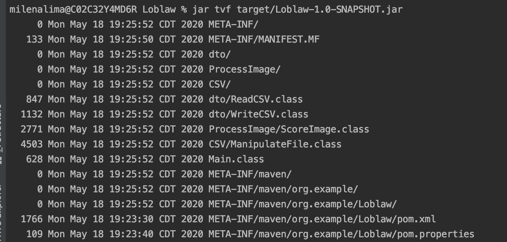
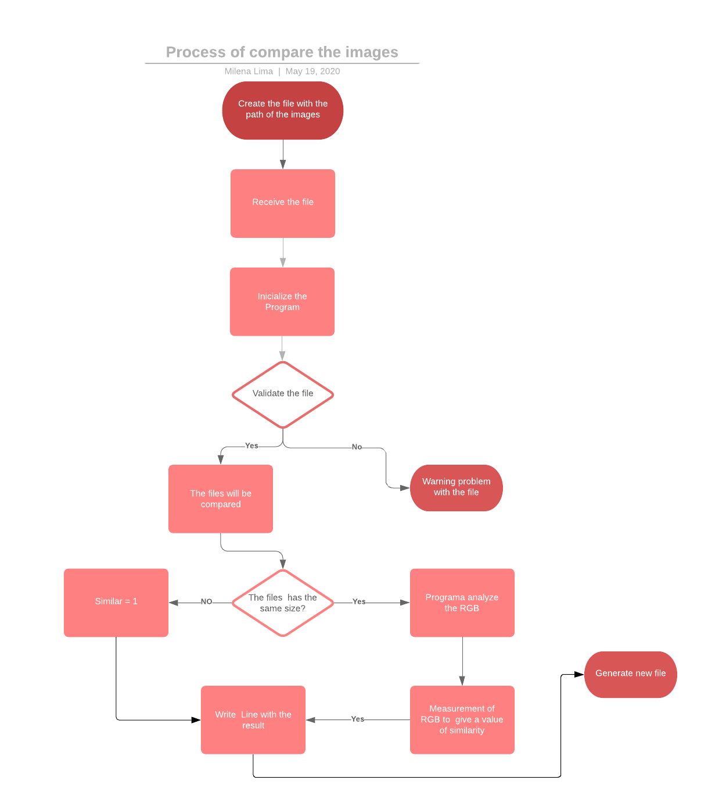
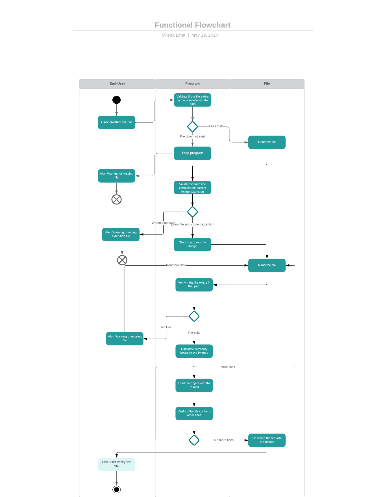

# Loblaw Project

SRE Assignment to Loblaw Position

# Getting Started

These instructions will get you a copy of the project up and running on your local machine for development and testing purposes.

## Pre requisites

GIT

Java JDK version 1.8.0_171 or newer

Apache Maven version 3.5.3 or above

IntelliJ IDEA

## Installing

1. Open a new command prompt

2. Run git clone https://github.com/milalima/Loblaw-Digital-SRE-Assignment.git

3. After cloning, go to project source folder and run : mvn clean generate-sources

4. Open Intellij IDEA

5. Create a new project

6. Point to project folder and select the data-extractor-template pom.xml file

7. Happy coding :)

## Usage

The library that is being used to create a new CSV with the results of the comparison of the images

#POM

```
<dependencies>
   <dependency>
       <groupId>com.opencsv</groupId>
       <artifactId>opencsv</artifactId>
        <version>4.2</version>
   </dependency>
</dependencies>
````

#JAVA

```java
// object used to CSV
import com.opencsv.CSVWriter;

```

Validation

```java
// validation if the extensation is correct: png, jpeg, gif
public static boolean isImage(String fileName)

// Validation if the file is in the correct path
public Boolean ValidateFileExit(String file)

```

Method responsible to score each pair of images 

```java

// First compararion between height and width 
if (w != b.getWidth() || h != b.getHeight()) {

// The getRGB (int, int) method returns the colors in ARGB format as an int (32 bits). 
// And with this result to get the value and start the comparison
int color1 = a.getRGB(x, y);
int color2 = b.getRGB(x, y);

// Mathematic method to return the intensity between each colour and estimate value
Math.sqrt(0.299 * dr * dr + 0.587 * dg * dg + 0.114 * db * db);

//Auxiliary methods to separate each components of the colours 
 public static int green (int c)
 public static int red (int c)
 public static int blue (int c)

//pixel by pixel is compared and normalization according to the image area
public double differenceImages(BufferedImage a, BufferedImage b)

/ Method to get the distance between each pixel of the color for comparison to be used in the similarity 
dif += distanceColors(color1, color2);

```

## How to run

To run and test the program you will nedd to:

1˚ - mvn clean install

     * To do the clean phase in each module of the program before running the install for each module existent.

2˚ - mvn package
 
     * Command to compile the code and to generate the .jar
       
   

3˚ - jar tvf target/Loblaw-1.0-SNAPSHOT.jar 
     
     * In this step it will be possible to see the tree of the program and the Main Class 

4˚ - java -cp target/Loblaw-1.0-SNAPSHOT.jar Main
      
      * Command that will make you run the program and generate the file with the results

## Process Diagram 




## Functional Flowchart Diagram 



## Consideration

How do you know if your code works?

* I did validations in the code to make sure that any programmatic mistake does not happen while is doing the defined task

* I wrote a modular and clean code to be sure that any mistake was not made it

* After read carefully the specification sent to me, I split into small parts to be sure what is necessary to deliver. Those parts were:
    
    1 - To read CSV;
    
    2 - To write CSV;
    
    3 - To process the image; 
    
    4 - Code structure and architecture; 
    
    5 - How to generate a deliverable to the end-user;
    
    6 - Documentation

How are you going to teach Bjorn how to use the program?

I could have two different ways to realize this:

1 - Creating a document all the steps he should follow to process the image and how the results will generate. This document will contain a specification of how the program was idealized and coded from the information provided, and the approached used to have the numbers generated by the analysis of the specific images related. 

This is an excellent manner to give a more number of people sufficient knowledge of how to start to use the system. 

2 - Schedule a meeting 1:1 with Bjorn to explain the project, take any possible doubt and understand futures updates, if necessary.
If the system starts to be used by other end users, create a plan to organize training with all interested parties so that agile and correct information about how the best way to use it.

From my point of view, personal approaches, when possible, it is the best way to teach a new system avoiding possible mistakes by the user in how to manage the functionality. 


Your manager Jeanie is assigning you to a different task and is making Ferris the maintainer of your application. How do you make sure he succeeds?

* I wrote a detailed Readme with primary information about the system;
* Included some comments in the code to be better understandably of what class or method is doing;
* I wrote a clean and self-read code to let it more accessible for anyone now or in the future could continue the development or maintenance.
* To schedule a meeting with him to explain all the steps that I made it into the code, and the decisions that I made while I was developing. 

How are you ensuring Bjorn gets the latest version of your application?

Keeping communication between the developer team and the end-user about the application. And this communication could be realized in different ways: 

* By Slack Channel, where all could send messages of doubts, issues, updates. Bringing more proximity to the people involved. 

* By E-mail sending updates about the program and any other news to the end-users. This way could be useful in cases when having a significant quantity of users, and it is necessary to send a quick message. 

* By Wiki or Internal website, where it is possible to put news about the software, and that is accessible to everyone. 

A Slack Channel will be useful to make Ferris succeeds in the maintainer, whereas he will have access to Bjorn and me to take any doubts about the code or the business.  
